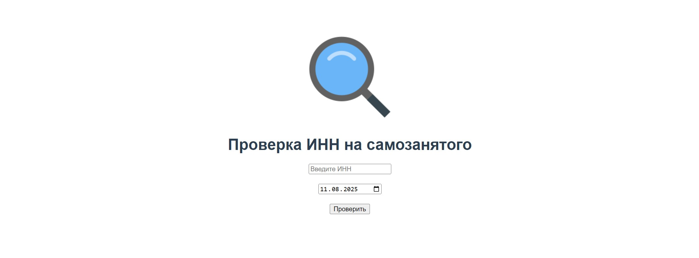

# 🔍 XanderCheckINN

**XanderCheckINN** — PET-проект для проверки ИНН на статус самозанятого. Использую открытые API https://npd.nalog.ru/.

[Демо-страница](https://sanyazola.github.io/XanderCheckINN/)

## Описание

Микропроект на Vue, использующий открытые API ФНС для проверки статуса ИП с упрощённой системой налогообложения (самозанятый). 

### 🚀 Возможности:

- 🔍 Проверка ИНН на статус самозанятого..
- 🗓 Возможность выбрать дату начала действия статуса.
- ⏳ Имеется лоадер.
- 🔄 Простая обработка ответных данных от API.

---

### Технологии и стек
- 🧠**Vue.js**: Фронт.
- 🖼**HTML & CSS**: Разметка и стили с небольшим адаптивом для мобильных устройст.

